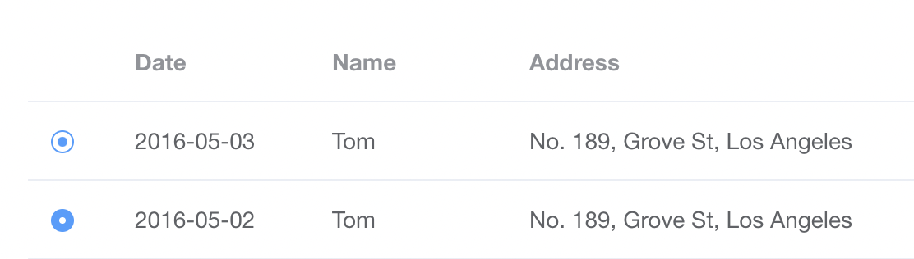

背景：一个使用 ElementUI 实现的多选表格，逻辑改造后只支持单选，需要把首列的复选框也改造成单选框的样式。

以下是两种较为常见的单选框样式和基于 ElementUI 原样式的改造实现：



```css
// 隐藏原本的对勾样式
.el-checkbox__inner:after {
  display: none;
}

// 给圆圈添加一个内边距，制造蓝点选中的效果
.el-checkbox__inner {
  border-radius: 100%;
  padding: 3px;
  background-clip: content-box;
}
```

```css
.el-checkbox__inner:after {
  display: none;
}

.el-checkbox__inner {
  border-radius: 100%;
}

// 选中时把背景置白，边框加粗，制造白点选中的效果
.el-checkbox__input.is-checked {
	border-width: 5px;
	background: #fff;
}
```

